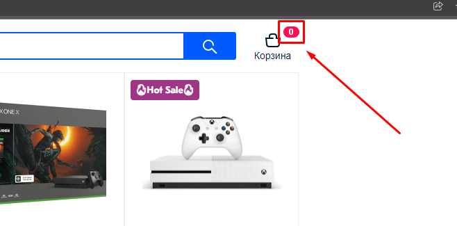

[github интенсива](https://github.com/illicchpv/glo-ozone)

## Урок 1. Подключение JavaScript, модальное окно, Webpack [ссылка](https://glo-academy.org/next_lesson_1)

### Исходники [(скачиваются сразу при кликие)](https://fs19.getcourse.ru/fileservice/file/download/a/12250/sc/181/h/60d60cf171c4eaee513801a2d7c9c643.zip)

### Полезные ссылки

  - Переменные  [ссылка](https://learn.javascript.ru/variables)
  - Var, let или const?  [ссылка](https://habr.com/ru/company/ruvds/blog/420359/)
  - Функции  [ссылка](https://learn.javascript.ru/function-basics)
  - Условия  [ссылка](https://learn.javascript.ru/ifelse)
  - Браузерные события  [ссылка](https://learn.javascript.ru/introduction-browser-events)
  - Поиск: getElement*, querySelector*  [ссылка](https://learn.javascript.ru/searching-elements-dom)

  - webpack [ссылка](https://webpack.js.org/)
      - [getting-started](https://webpack.js.org/guides/getting-started/)
      ```cmd
        > npm init -y
        > npm install webpack webpack-cli --save-dev
        > npm i
      ```


### Задание
  скачать исходники под уроком и повторить код

---  

### Урок 2. Получение данных из файлов БД [ссылка](https://glo-academy.org/next_lesson_2)

#### Материалы для урока (скачиваются при клике)  [ссылка](https://fs17.getcourse.ru/fileservice/file/download/a/12250/sc/258/h/6217cf4cd75599eb5a4eaf04e7e3f637.zip)

JSONPlaceholder [ссылка](https://jsonplaceholder.typicode.com/)
JSON-server [ссылка](https://github.com/typicode/json-server)
  ```cmd
    > npm install -g json-server
    > npm i json-server@0.17.4
    > json-server --watch db/db.json --port 3000
  ```
  ??? http://localhost:3000/profile
  ??? http://localhost:3000/comments
  + http://localhost:3000/goods


Firebase [ссылка](https://console.firebase.google.com/u/1/)

https://mytest-4d899-default-rtdb.firebaseio.com/goods.json

управление базой данных goods [ссылка
](https://console.firebase.google.com/u/1/project/mytest-4d899/database/mytest-4d899-default-rtdb/data/~2F)

управление пользователями [ссылка
](https://console.firebase.google.com/project/mytest-4d899/settings/iam)


добавить в файл settings.json
```js
"liveServer.settings.ignoreFiles": [
    "db/db.json"
]
```

#### Задание

Повторить код за уроком

---

### Урок 3. Отрисовка полученных данных на странице [ссылка](https://glo-academy.org/next_lesson_3)
- Фильтрация данных по категории. 
- Сортировка данных по параметрам. 
- Вывод карточек товаров. 
- Реализация поиска по названию

#### Задание

Повторить код за уроком


#### Усложнённое
Реализовать фильтрацию товаров по цене


---

### Урок 4. Корзина товаров [ссылка](https://glo-academy.org/next_lesson_4)

Реализуем корзину товаров. Реализуем отправку данных корзины

#### Задание

Повторить код за уроком

#### Усложнённое
Реализовать подсчет товаров в корзине. Результат выводить вот в эту иконку возле корзины.
Значение должно подсчитываться при загрузке страницы, при добавлении товара в корзину и 
при удалении товара из корзины. Так же обнуляться при отправке данных.
